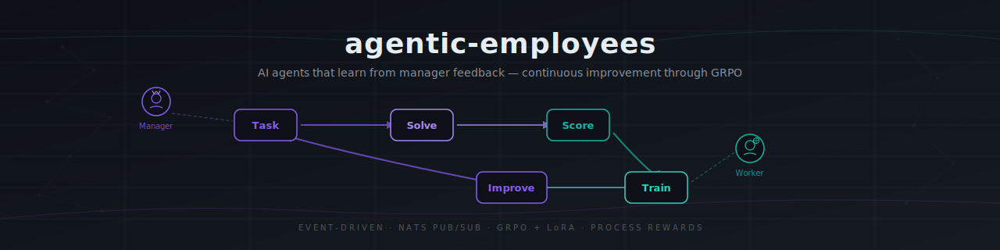

<div align="center">


# agentic-employees

**AI agents that learn from manager feedback — like performance appraisals that actually improve performance.**

[](https://python.org)
[](tests/)
[](RESEARCH-EXPERIMENT.md)
[](LICENSE)
[](https://nats.io)
[](docker-compose.yml)

[Architecture](#architecture) | [Quick Start](#quick-start) | [Features](#features) | [How It Works](#how-it-works) | [Experiments](#experiments) | [Roadmap](#roadmap)

</div>

---

## The Problem

Most AI agent frameworks are **fire-and-forget** — agents complete tasks but never learn from their mistakes.

- Agents repeat the same errors across conversations
- No feedback loop between evaluation and model improvement
- RL training pipelines are disconnected from agent runtimes
- Scaling from 1 agent to N agents requires rearchitecting everything

**agentic-employees** closes the loop: managers evaluate agent work step-by-step, scores feed into GRPO training, and improved weights hot-swap back into workers — continuously, without downtime.

---

## Architecture

```
User --> OpenClaw Web UI (:3000)
           |
           v
+----------------------+    +----------+
|  OpenClaw Gateway    |    |   NATS   |
|  (:18789)            |    |  (:4222) |
|  Manager + Worker    |    |          |
|  agents              |    |          |
+----------+-----------+    +----+-----+
           | exec/curl           |
     +-----v---------------------v------+
     |       Bridge Service (:8100)      |
     |  HTTP API <--> NATS pub/sub       |
     |  (Python, aiohttp + nats-py)      |
     +------------------+---------------+
                        | NATS (unchanged)
          +-------------+-------------+
          v             v             v
   PRM Evaluator  Training Loop   Ollama
   (LLM-as-judge) (GRPO + LoRA)  (:11434)
```

**OpenClaw** runs Manager + Worker agents (identity, memory, web UI) --> agents call the **Bridge Service** via HTTP --> Bridge translates to **NATS** pub/sub --> **PRM Evaluator** scores each reasoning step --> **Training Loop** runs GRPO --> model improves --> workers hot-swap weights --> repeat.

---

## Quick Start

```bash
# Clone and start everything (5 services)
git clone https://github.com/lonexreb/agentic-employees.git
cd agentic-employees
./scripts/demo.sh

# Open http://localhost:3000 — message the Manager agent
```

Or manually:

```bash
docker compose up -d
docker compose exec ollama ollama pull qwen2.5:1.5b
# Open http://localhost:3000
```

---

## Features

| Problem | Solution |
|---------|----------|
| Agents never learn from mistakes | **GRPO training loop** turns manager feedback into gradient updates |
| Outcome-only evaluation misses reasoning errors | **Process Reward Model (PRM)** scores each reasoning step, not just the final answer |
| Training pipelines block inference | **Event-driven architecture** — training runs async via NATS, never blocks serving |
| Swapping models requires restarts | **LoRA hot-swap** — new adapters load at runtime, zero downtime |
| Hardcoded to one LLM provider | **InferenceClient protocol** — swap Ollama, vLLM, or any OpenAI-compatible API |
| Scaling agents = rewriting code | **NATS pub/sub** — add workers by subscribing to the same topic |
| Complex multi-service setup | **Docker Compose** — one command starts all 5 services |

---

## How It Works

```
1. Manager receives user request via OpenClaw Web UI
2. Manager decomposes request into tasks, publishes TaskEvent to NATS
3. Worker picks up task, generates step-by-step solution via LLM
4. Worker publishes ResultEvent (with <step>-tagged reasoning)
5. PRM Evaluator scores each step on progress + correctness (0-1)
6. Scored rollouts batch in RolloutBuffer until group_size ready
7. GRPO Trainer computes group-relative advantages, runs gradient step
8. LoRA checkpoint saved, ModelUpdateEvent published to NATS
9. Workers hot-swap to new adapter — agents just got smarter
```

---

## Component Overview

| Service | Port | Role |
|---------|------|------|
| **NATS** | 4222, 8222 | Event broker — all agent coordination flows through pub/sub |
| **Ollama** | 11434 | LLM inference (dev). Graduates to vLLM for production |
| **OpenClaw** | 3000, 18789 | Agent runtime — identity, memory, web UI, skill execution |
| **Bridge** | 8100 | HTTP <--> NATS translation so OpenClaw agents reach the event bus |
| **Training** | -- | PRM Evaluator + GRPO Training Loop (runs as background consumer) |

---

## Local Development

```bash
# Prerequisites: Python 3.10+
python -m venv .venv && source .venv/bin/activate

# Base install (no GPU needed)
pip install -e ".[dev]"

# Run tests (72 pass standalone, no NATS/Ollama needed)
pytest tests/ -v

# Run full integration tests (requires nats-server)
nats-server &
pytest tests/ -v

# Run demo loop (requires NATS; falls back to EchoWorker without Ollama)
python -m src

# Run Bridge service standalone
pip install -e ".[bridge]"
python -m src.bridge

# Run Training service standalone
pip install -e ".[training]"
python -m src.services.training
```

### Optional Extras

| Extra | Command | What It Adds |
|-------|---------|-------------|
| Training | `pip install -e ".[training]"` | torch, transformers, peft (GRPO + LoRA) |
| Inference | `pip install -e ".[inference]"` | openai, httpx (vLLM / OpenAI-compatible) |
| Bridge | `pip install -e ".[bridge]"` | aiohttp (HTTP API for OpenClaw) |
| vLLM | `pip install -e ".[vllm]"` | vLLM GPU inference server |
| OpenRLHF | `pip install -e ".[openrlhf]"` | Production GRPO training (Ray + DeepSpeed) |

---

## Configuration

All environment variables are optional with sensible defaults:

| Variable | Default | Description |
|----------|---------|-------------|
| `NATS_URL` | `nats://localhost:4222` | NATS broker URL |
| `LLM_MODEL` | `qwen2.5:1.5b` | Model for LLM workers |
| `OLLAMA_HOST` | `http://localhost:11434` | Ollama server URL |
| `INFERENCE_BACKEND` | `ollama` | `"ollama"` or `"openai"` (vLLM/Semantic Router) |
| `INFERENCE_BASE_URL` | *(auto)* | Base URL for inference server |
| `INFERENCE_API_KEY` | *(empty)* | API key for inference server |
| `TRAINER_BACKEND` | `standalone` | `"standalone"` (GRPOTrainer) or `"openrlhf"` (GPU) |
| `BRIDGE_PORT` | `8100` | Bridge HTTP API port |
| `MANAGER_ID` | `manager-01` | Manager agent ID |
| `WORKER_ID` | `worker-01` | Worker agent ID |
| `TASK_TIMEOUT_SECONDS` | `30` | Task completion timeout |

---

## Testing

```bash
# Standalone (no external services)
pytest tests/ -v                          # 72 pass, 5 skip

# Skip slow torch-dependent tests
pytest tests/ -v -k "not slow"

# Full suite (requires NATS running)
nats-server &
pytest tests/ -v                          # 77 pass
```

| Test Suite | Tests | External Deps |
|------------|-------|---------------|
| Events, types & serialization | 8 | None |
| Rewards (scorer + evaluator) | 8 | None |
| Training (GRPO math + trainer) | 20 | torch *(optional, skips cleanly)* |
| Inference (client + vLLM LoRA) | 15 | None *(mocked)* |
| Workers (model reload) | 6 | None |
| Bridge (HTTP API) | 10 | None |
| Integration (full loop) | 5 | NATS |
| Bridge integration | 1 | NATS |

---

## Roadmap

| Phase | Status | Description |
|-------|--------|-------------|
| **Phase 1** | Done | Scaffolding, docs, git, GitHub |
| **Phase 2** | Done | Event loop — Manager/Worker agents, NATS pub/sub |
| **Phase 3** | Done | LLM workers (Ollama), PRM scoring (LLM-as-judge), training bridge |
| **Phase 4** | Done | Standalone GRPO trainer, LoRA fine-tuning, TrainingLoop orchestrator |
| **Phase 5** | Done | Inference abstraction, weight hot-swap, OpenRLHF integration |
| **Phase 6** | Done | OpenClaw integration, Bridge Service, Docker Compose demo |
| **Phase 7** | Next | Trained PRM, DAPO graduation, multi-model routing, HaluGate |

### Phase 7 — What's Next

| Item | Description | Prerequisite |
|------|-------------|-------------|
| **Trained PRM model** | Replace LLM-as-judge with a trained process reward model | 10K+ scored trajectories (accumulate via Docker demo) |
| **DAPO graduation** | Upgrade GRPO to DAPO (Clip-Higher + dynamic sampling) | OpenRLHF functional + GPU access |
| **Multi-model routing** | Semantic Router routes tasks to best-fit models | Deploy Semantic Router, configure `INFERENCE_BASE_URL` |
| **HaluGate scorer** | Hallucination detection as complementary StepScorer | Implement StepScorer protocol adapter |
| **OpenClaw WebSocket relay** | Bidirectional Bridge <--> OpenClaw session communication | websockets library integration |
| **Pin OpenClaw Docker image** | Avoid breaking changes from `latest` tag | Find stable OpenClaw release |

---

## Experiments

Practical things you can run on the current codebase:

### 1. End-to-End Docker Demo
Run `./scripts/demo.sh`, open the web UI, send coding tasks, observe the full Manager --> Worker --> PRM --> Training loop.
**Measure:** response latency, PRM scores, training loss convergence.

### 2. PRM Score Quality Assessment
Send 20+ diverse coding tasks through the pipeline. Compare LLM-as-judge scores against manual human scoring.
**Measure:** correlation between judge scores and actual code quality.

### 3. GRPO Training Convergence
Configure small batch/group sizes, run repeated tasks. Observe if training loss decreases and model outputs improve over iterations.
**Measure:** loss curve, advantage distribution, checkpoint quality.

### 4. Multi-Worker Scaling
Spin up multiple worker containers subscribing to the same NATS topics. Send concurrent tasks, observe load distribution.
**Measure:** throughput, NATS message latency, result correctness.

### 5. Model Hot-Swap Validation
Train a LoRA checkpoint via GRPO, publish a ModelUpdateEvent, verify workers reload without downtime.
**Measure:** zero-downtime swap success, output quality before/after.

### 6. Bridge API Stress Test
Use `wrk` or `hey` to load-test Bridge endpoints under concurrent requests.
**Measure:** requests/sec, p99 latency, NATS backpressure behavior.

### 7. Cross-Backend Inference Comparison
Run the same tasks with Ollama vs vLLM via the InferenceClient protocol.
**Compare:** response quality, latency, token throughput.

---

## Tech Stack

| Layer | Technology | Purpose |
|-------|-----------|---------|
| Event Broker | [NATS](https://nats.io) | Pub/sub agent coordination (10M+ msg/sec, <1ms latency) |
| Agent Runtime | [OpenClaw](https://github.com/openclaw/openclaw) | Identity, memory, web UI, skill execution |
| LLM Inference | [Ollama](https://ollama.com) (dev) / [vLLM](https://github.com/vllm-project/vllm) (prod) | Model serving with LoRA hot-swap |
| RL Training | Standalone GRPO / [OpenRLHF](https://github.com/OpenRLHF/OpenRLHF) | Group-relative policy optimization with LoRA |
| Process Rewards | LLM-as-judge PRM | Step-level scoring (graduates to trained PRM) |
| Serialization | [Pydantic v2](https://docs.pydantic.dev/) | Event type validation and JSON serialization |

### Key Research

- [GRPO (DeepSeekMath)](https://arxiv.org/abs/2402.03300) — Group-relative advantage without critic network
- [DAPO (ByteDance)](https://arxiv.org/abs/2503.14476) — Clip-Higher + dynamic sampling for production RL
- [AgentPRM](https://arxiv.org/abs/2502.10325) — Monte Carlo rollouts for step-level agent rewards
- [Let's Verify Step by Step (OpenAI)](https://arxiv.org/abs/2305.20050) — Process supervision >> outcome supervision

---

## Documentation

| Document | Purpose |
|----------|---------|
| [PLAN.md](./PLAN.md) | Technical research & architecture bible (papers, analysis, decisions) |
| [CLAUDE.md](./CLAUDE.md) | Project conventions for Claude Code |
| [LEARNING.md](./LEARNING.md) | Mistake/lesson tracking log |
| [RESEARCH-EXPERIMENT.md](./RESEARCH-EXPERIMENT.md) | Phase experiment records and findings |

---

## Contributing

```bash
# Install dev dependencies
pip install -e ".[dev]"

# Run linter
ruff check src/ tests/

# Run tests
pytest tests/ -v
```

Conventional commits: `feat:`, `fix:`, `docs:`, `refactor:`, `test:`, `chore:`

---

## License

MIT
